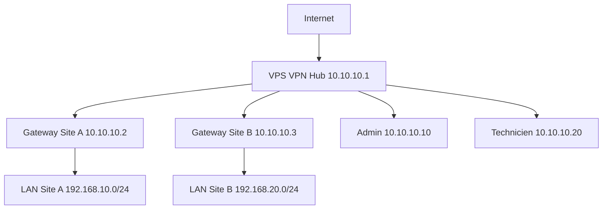
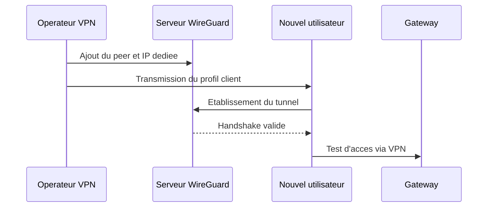

# Acces VPN

## Resume executif

Ce document presente une architecture VPN de type hub-and-spoke pour l'acces distant aux gateways terrain. Il est redige comme un guide operatoire concret, afin qu'une equipe puisse le suivre pas a pas pour mettre en place le tunnel, puis ajouter ou retirer des utilisateurs de facon sure et tracee.

## 1. Objectif et principes

Objectifs:
1. proteger l'acces aux gateways et aux sous-reseaux locaux;
2. offrir une methode standard pour exploitation et support;
3. garantir la tracabilite des acces techniques.

Principes de conception:
1. un serveur VPN central sur VPS;
2. chaque gateway et chaque utilisateur est un peer explicite;
3. droits reseau limites par `AllowedIPs`;
4. gestion du cycle de vie des cles (creation, rotation, revocation).

## 2. Architecture cible



Le serveur VPN agit comme point de convergence. Les gateways restent non exposees publiquement et deviennent accessibles uniquement a travers le tunnel, ce qui reduit fortement la surface d'attaque.

## 3. Plan d'adressage recommande

| Element | Adresse VPN |
|---|---|
| Hub VPS | 10.10.10.1/24 |
| Gateway site A | 10.10.10.2/24 |
| Gateway site B | 10.10.10.3/24 |
| Administrateur | 10.10.10.10/24 |
| Technicien | 10.10.10.20/24 |

Regle: ne jamais reutiliser une adresse VPN deja allouee.

## 4. Tutoriel de mise en place du serveur VPN

### 4.1 Preparation du VPS

```bash
sudo apt update
sudo apt install -y wireguard iptables-persistent
```

Activer le forwarding IPv4:

```bash
echo "net.ipv4.ip_forward=1" | sudo tee -a /etc/sysctl.conf
sudo sysctl -p
```

### 4.2 Generation des cles (serveur)

```bash
umask 077
wg genkey | tee /etc/wireguard/server_private.key | wg pubkey > /etc/wireguard/server_public.key
```

### 4.3 Configuration `wg0.conf`

```ini
[Interface]
Address = 10.10.10.1/24
ListenPort = 51820
PrivateKey = <SERVER_PRIVATE_KEY>

# Gateway Site A
[Peer]
PublicKey = <GATEWAY_A_PUBLIC_KEY>
AllowedIPs = 10.10.10.2/32, 192.168.10.0/24

# Utilisateur Admin
[Peer]
PublicKey = <ADMIN_PUBLIC_KEY>
AllowedIPs = 10.10.10.10/32
```

### 4.4 Regles firewall minimales

```bash
sudo iptables -A FORWARD -i wg0 -j ACCEPT
sudo iptables -A FORWARD -o wg0 -j ACCEPT
sudo netfilter-persistent save
```

### 4.5 Activation et verification

```bash
sudo systemctl enable wg-quick@wg0
sudo systemctl start wg-quick@wg0
sudo wg
```

## 5. Tutoriel de configuration d'une gateway

Parametres de base a definir cote gateway:
1. adresse interface VPN dediee (ex: 10.10.10.2/24);
2. cle privee locale;
3. cle publique du serveur;
4. endpoint VPS `IP_PUBLIC_VPS:51820`;
5. `AllowedIPs` vers le reseau VPN (et eventuels reseaux autorises).

Controle immediate apres activation:
1. handshake recent visible sur le serveur;
2. ping de la gateway VPN depuis un poste admin;
3. acces HTTP/SSH a la gateway via son IP tunnel.

## 6. Tutoriel: ajouter un nouvel utilisateur au VPN

Cette section est volontairement normative et peut etre appliquee telle quelle.

### 6.1 Etape 1: generer les cles utilisateur

```bash
mkdir -p ~/wg-users/user_01
cd ~/wg-users/user_01
umask 077
wg genkey | tee user_01_private.key | wg pubkey > user_01_public.key
```

### 6.2 Etape 2: reserver une IP VPN libre

Exemple d'allocation: `10.10.10.21/24`.

### 6.3 Etape 3: declarer le peer sur le serveur

Ajouter dans `/etc/wireguard/wg0.conf`:

```ini
[Peer]
PublicKey = <USER_01_PUBLIC_KEY>
AllowedIPs = 10.10.10.21/32
```

Recharger:

```bash
sudo systemctl restart wg-quick@wg0
sudo wg
```

### 6.4 Etape 4: fournir la configuration client

```ini
[Interface]
PrivateKey = <USER_01_PRIVATE_KEY>
Address = 10.10.10.21/24

[Peer]
PublicKey = <SERVER_PUBLIC_KEY>
Endpoint = <VPS_PUBLIC_IP>:51820
AllowedIPs = 10.10.10.0/24, 192.168.10.0/24
PersistentKeepalive = 25
```

### 6.5 Etape 5: recette d'ajout utilisateur

1. l'utilisateur active le tunnel;
2. verification `latest handshake` sur le serveur;
3. test `ping` vers IP VPN gateway;
4. test acces a une ressource du LAN distant autorise.



## 7. Procedure de revocation d'un utilisateur

1. supprimer le bloc `[Peer]` correspondant du serveur;
2. redemarrer le service WireGuard;
3. verifier l'absence de handshake pour cet utilisateur;
4. archiver la fiche de revocation (date, motif, operateur).

## 8. Controles d'exploitation courants

Commandes utiles:

```bash
sudo wg
ip route
sudo systemctl status wg-quick@wg0
```

Indicateurs minimaux:
1. handshakes recents pour peers actifs;
2. trafic recu/emis non nul sur liens attendus;
3. routes presentes vers sous-reseaux des sites.

## 9. Securite et bonnes pratiques

1. un peer par personne et par equipement, jamais partage de profil;
2. rotation periodique des cles sensibles;
3. principe du moindre acces via `AllowedIPs` restreints;
4. revocation immediate lors de depart ou compromission suspectee;
5. journalisation systematique des creations/modifications/suppressions de peers.

## 10. Conclusion

Le modele VPN propose offre un compromis robuste entre securite et operabilite. L'approche tutorielle permet une appropriation rapide par les equipes d'exploitation et garantit une integration controlee des nouveaux utilisateurs au reseau prive industriel.
