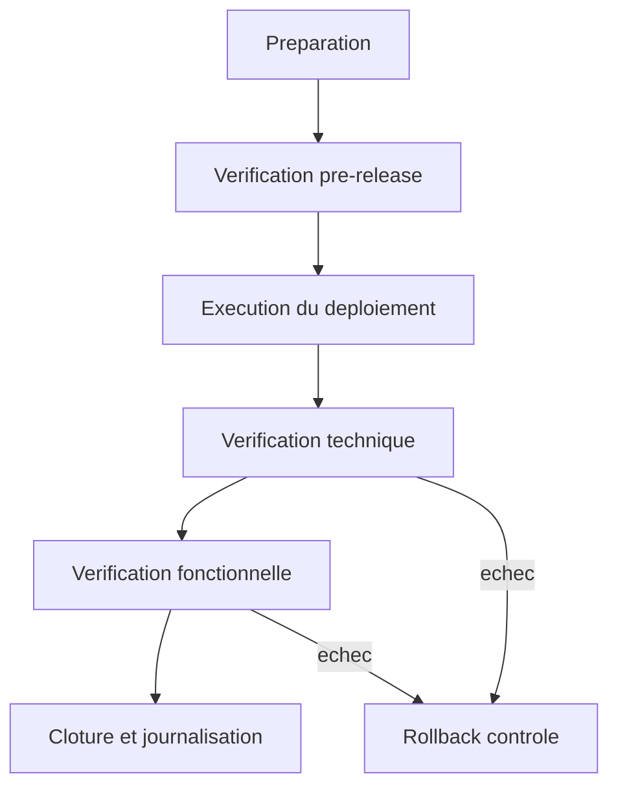
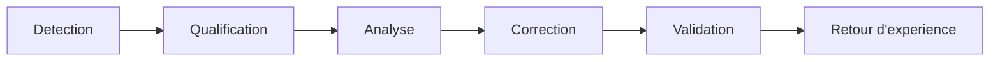

# Deploiement et Exploitation

## Resume executif

Ce document presente le cadre operatoire de SIMES-BF pour passer d'un deploiement technique a une exploitation durable. L'enjeu n'est pas uniquement de demarrer les services, mais de maintenir un niveau de service previsible dans la duree, avec des regles partagees, des controles mesurables et des procedures explicites en cas d'incident.

## 1. Objet et perimetre

Le rapport couvre:
1. la gouvernance des mises en production;
2. la procedure de deploiement standard;
3. la verification post-release;
4. le fonctionnement en regime nominal;
5. la gestion d'incident, de rollback et de capacite.

Il constitue une reference commune pour les equipes techniques, les responsables d'exploitation et les parties prenantes qui pilotent la disponibilite de la plateforme.

## 2. Gouvernance d'exploitation

### 2.1 Roles et responsabilites

| Role | Responsabilite principale |
|---|---|
| Responsable release | valide la fenetre de changement et l'autorisation de mise en production |
| Operateur plateforme | execute la procedure technique et renseigne les preuves |
| Referent applicatif | valide la conformite fonctionnelle post-release |
| Responsable exploitation | arbitre en cas de risque de disponibilite |

### 2.2 Regles de fonctionnement

1. aucune mise en production sans fenetre annoncee;
2. aucune release sans plan de retour arriere prepare;
3. toute action critique laisse une preuve horodatee;
4. la decision de cloture repose sur des criteres objectifs, pas sur une impression.

## 3. Procedure de deploiement

### 3.1 Vue d'ensemble



### 3.2 Etape 1: preparation

1. verifier les variables d'environnement et secrets;
2. confirmer l'etat systeme (CPU, RAM, disque, reseau);
3. s'assurer qu'aucun incident majeur n'est ouvert;
4. prepositionner les commandes de verification post-release.

### 3.3 Etape 2: execution

Commandes de reference:

```bash
./deploy.sh
./deploy.sh --no-build
./deploy.sh --check-pipeline
```

Regles de conduite:
1. executer une seule strategie de release a la fois;
2. conserver l'ordre preparation -> deploiement -> verification;
3. enregistrer les sorties utiles (logs, etats, statut final).

### 3.4 Etape 3: verification post-release

| Controle | Critere d'acceptation |
|---|---|
| Conteneurs | services critiques en etat stable |
| API sante | endpoint health repond et expose etat coherent |
| Pipeline | endpoint pipeline coherent avec l'activite attendue |
| Ingestion | /ingest/milesight atteignable |
| Frontend | acces web fonctionnel et navigation de base validee |

En pratique, une release n'est acceptee que si l'ensemble des controles est positif et documente.

## 4. Procedure de rollback

### 4.1 Conditions de declenchement

1. echec d'un controle critique post-release;
2. degradation severe de performance;
3. regression fonctionnelle bloquante sur parcours principal.

### 4.2 Sequence de retour arriere

1. figer les changements non indispensables;
2. restaurer la version precedente des services concernes;
3. relancer les checks techniques;
4. consigner la decision et ouvrir une analyse cause racine.

## 5. Exploitation en regime nominal

### 5.1 Routines quotidiennes

1. verifier la disponibilite API et ingestion;
2. suivre les files de jobs et les echecs de traitement;
3. controler la fraicheur de la telemetrie;
4. suivre les incidents ouverts et leur avancement.

### 5.2 Routines hebdomadaires

1. revue des erreurs recurrentes et tendances;
2. verification de la pression capacitaire base/stockage;
3. verification de l'etat des sauvegardes.

### 5.3 Routines mensuelles

1. exercice de restauration sur environnement de validation;
2. revue des comptes et privileges;
3. revue de performance et ajustements de capacite.

## 6. Niveau de service et pilotage

### 6.1 Indicateurs d'exploitation (SLI)

1. disponibilite API sur fenetre glissante;
2. taux de succes des requetes d'ingestion;
3. age maximal d'une mesure avant affichage utilisateur;
4. taille et age des files de jobs;
5. delai moyen de resolution des incidents.

### 6.2 Objectifs de service proposes (SLO)

| Domaine | Objectif cible |
|---|---|
| Disponibilite API | >= 99.5% mensuel |
| Ingestion | >= 99% de batches acceptes |
| Fraicheur donnees | < 15 min sur parcours nominal |
| Traitement incident critique | prise en charge immediate |

Ces objectifs doivent etre revus regulierement, en fonction de la croissance du nombre d'utilisateurs et de l'extension du parc instrumente.

## 7. Gestion de capacite

Les specifications VPS de depart ont permis de lancer la plateforme. Pour l'exploitation multi-utilisateurs, il faut anticiper les seuils de saturation et planifier l'evolution:
1. CPU soutenu > 70% sur plages d'activite;
2. RAM proche de saturation recurrente;
3. files de jobs en augmentation continue;
4. latence API ou ingestion en degradation.

Une revue capacitaire trimestrielle est recommandee, avec une decision explicite de scaling vertical ou de redistribution des charges.

## 8. Gestion d'incident

### 8.1 Classification

| Niveau | Impact | Priorite de traitement |
|---|---|---|
| Critique | interruption de service principal | immediate |
| Majeur | degradation forte sans interruption totale | prioritaire |
| Mineur | impact partiel ou contournable | planifiee |

### 8.2 Cycle de traitement



Discipline minimale:
1. tracer chaque etape avec horodatage;
2. conserver les preuves techniques;
3. formuler une action preventive a la cloture.

## 9. Traces, preuves et auditabilite

Pour chaque release et chaque incident, conserver au minimum:
1. date/heure de debut et fin;
2. acteurs impliques;
3. commandes et actions executees;
4. resultat des controles;
5. decision finale (acceptation, rollback, correction differee).

## 10. Conclusion

Le deploiement n'est que la premiere etape. La valeur reelle de SIMES-BF en production repose sur une exploitation rigoureuse, mesurable et evolutive. Ce cadre vise a rendre la plateforme fiable a court terme et gouvernable a long terme, dans un contexte ou les utilisateurs et les usages vont continuer d'augmenter.

