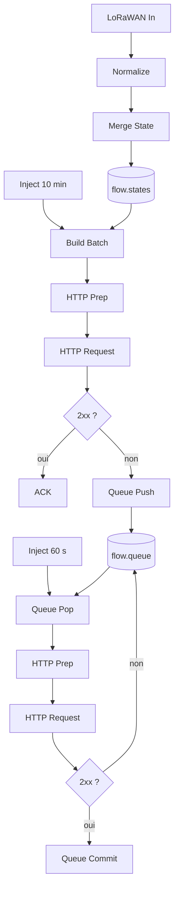
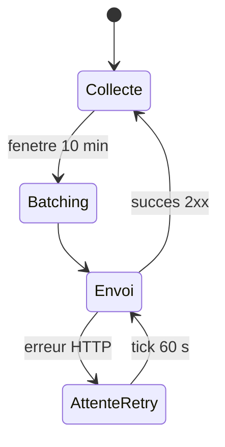

# Edge Node-RED

## Resume executif

Ce document formalise le comportement de reference du pipeline Node-RED execute en edge sur gateway. Le pipeline remplit trois fonctions critiques: transformer des uplinks heterogenes en structures homogenes, reconstruire des snapshots coherents par equipement, et maintenir la continuite de transmission vers le backend en cas d'aleas reseau.

## 1. Objectif et perimetre

Le perimetre couvre exclusivement la couche edge:
1. reception uplink;
2. normalisation du message;
3. fusion incremental par `devEUI`;
4. emission batch toutes les 10 minutes;
5. reprise sur erreur via queue locale et retries periodiques.

Sont explicitement exclus:
1. persistence backend;
2. agregations workers;
3. restitution applicative front-end.

## 2. Architecture fonctionnelle edge

## 3. Contrat de donnees interne

### 3.1 Message normalise

Concretement, chaque uplink est transforme en objet canonical:
1. identifiant equipement (`devEUI`);
2. horodatage de reception;
3. metadonnees radio (`rssi`, `snr`, `freq`, `fcnt`, `fport`);
4. charge utile metrique (`data`).

### 3.2 Etat fusionne par equipement

`flow.states[devEUI]` contient:
1. `data`: dernieres valeurs connues par cle metrique;
2. `meta`: informations de contexte (`lastSeen`, `gatewayId`);
3. `radio`: dernier etat radio disponible.

Invariance fonctionnelle: chaque champ de `data` peut etre mis a jour independamment, sans ecraser les autres mesures deja collectees.

### 3.3 Contrat batch sortant

Le batch transmis doit contenir:
1. metadonnees de fenetre (`ts_batch_start`, `ts_batch_end`, `window_sec`);
2. identifiant de gateway;
3. tableau `devices` avec snapshot par `devEUI`.

## 4. Mecanisme de fusion multi-paquets

Les compteurs peuvent emettre des trames fragmentaires. Le mecanisme de fusion applique donc:
1. une cle de consolidation unique par `devEUI`;
2. une union de champs metriques au fil des uplinks;
3. une conservation des dernieres metadonnees radio recues.

Cette approche reduit le risque de snapshots incomplets au moment du batching.

## 5. Mecanisme de resilience et reprise

### 5.1 Strategie de retry

1. tout echec HTTP non-2xx provoque un `Queue Push`;
2. la queue locale est balayee periodiquement (60 s);
3. un succes declenche `Queue Commit` (dequeue).

### 5.2 Propriete cible

Le design vise une livraison eventual-consistent pendant les coupures courtes, sans bloquer le pipeline de collecte.

### 5.3 Limite structurelle

Une queue en memoire reste vulnerable a un redemarrage brutal de la gateway.

## 6. Exigences non fonctionnelles edge

1. reduction du volume de trafic montant par batching;
2. stabilite de la latence de cycle sur fenetre de 10 minutes;
3. robustesse face aux erreurs reseau intermittentes;
4. isolation des traitements edge de la sante backend immediate.

## 7. Indicateurs de performance et de sante

Indicateurs recommandes:
1. taille de `flow.queue`;
2. age moyen des batches en attente;
3. taux de succes HTTP par fenetre;
4. temps moyen entre reception uplink et emission batch;
5. nombre de devices actifs par fenetre.

## 8. Plan de durcissement recommande

1. persistance locale de queue (fichier/SQLite) pour reprise post-reboot;
2. endpoint health edge explicitant etat states/queue;
3. mecanisme de backoff progressif pour eviter tempete de retries;
4. seuil d'alerte sur queue vieillissante.

## 9. Criteres d'acceptation technique

1. un uplink valide produit un enrichissement de `flow.states`;
2. un batch est emis a periodicite ciblee avec structure conforme;
3. un echec d'envoi place bien l'objet en queue;
4. un succes ulterieur retire l'objet de la queue;
5. la pipeline reste active pendant les erreurs backend temporaires.

## 10. Conclusion

La couche Edge Node-RED constitue le premier mecanisme de fiabilisation de la chaine de donnees energetiques. Sa valeur operationnelle depend de la qualite de la fusion multi-paquets et de la robustesse de la reprise. Le passage a une persistance locale de queue reste la priorite technique majeure pour franchir un palier de resilience.
