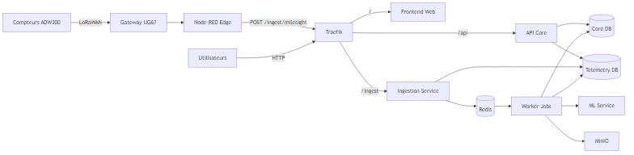
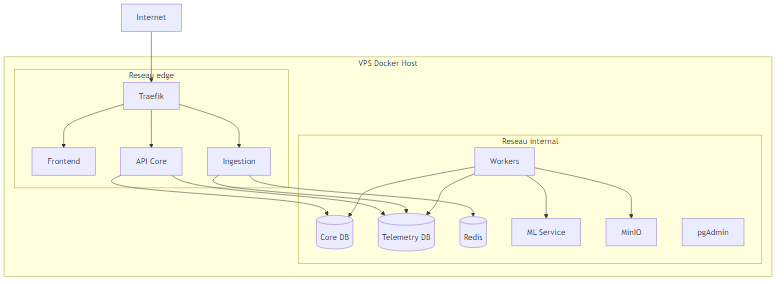
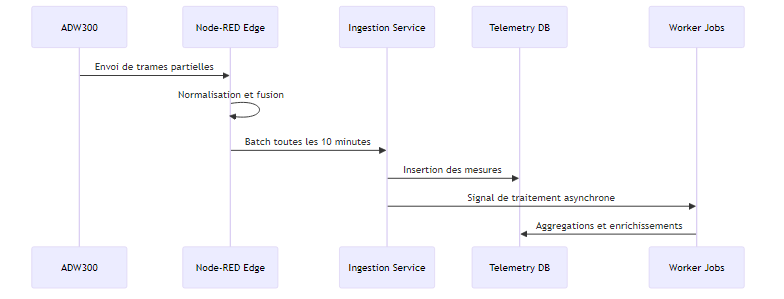

# Architecture et Infrastructure

## Resume executif

Ce document decrit l'architecture effectivement deployee pour SIMES-BF et la logique qui a conduit aux choix techniques actuels. Il distingue volontairement les specifications VPS initiales de developpement et les specifications VPS cibles d'exploitation, afin d'eviter toute confusion entre un environnement de lancement et un environnement multi-utilisateurs en regime stable.

## 1. Specifications VPS actuelles

### 1.1 Specifications VPS initiales de developpement

Les specifications VPS de depart ont ete choisies pour accelerer le developpement, valider la chaine technique complete, et maitriser les couts de demarrage. Ces specifications sont les suivantes:
1. hebergement VPS public;
2. 2 vCPU;
3. 8 Go de RAM;
4. Docker et Docker Compose actifs;
5. outillage d'administration de conteneurs et de supervision systeme deja en place.

Cette base est suffisante pour un cycle de mise au point et des usages limites. Elle ne doit pas etre interpretee comme la capacite finale cible pour une exploitation avec plusieurs organisations et plusieurs utilisateurs simultanes.

### 1.2 Effet de ces specifications sur la conception

Avec 2 vCPU et 8 Go RAM, l'architecture a ete volontairement concue pour rester sobre:
1. decouplage ingestion temps reel et traitements lourds via files de jobs;
2. separation des bases pour eviter la contention transactionnelle;
3. exploitation en conteneurs limites en CPU et memoire pour prevenir l'instabilite globale;
4. traitement edge (Node-RED) pour reduire la pression reseau et backend.

### 1.3 Specifications VPS cibles d'exploitation

| Dimension | Etat actuel | Cible recommandee |
|---|---|---|
| CPU | 2 vCPU | 4 vCPU pour marge workers et ML |
| RAM | 8 Go | 8 a 12 Go selon croissance telemetrie |
| Stockage | SSD VPS | SSD avec reserve pour retention et backups |
| Reseau | exposition HTTP + admin | exposition minimale + VPN privilegie |

Pour une exploitation reelle multi-utilisateurs, la revision a la hausse de la capacite est un passage normal. Elle permet d'absorber les pics de consultation, les traitements asynchrones et les charges analytiques sans degrader l'experience utilisateur.

## 2. Vision systeme et finalite metier

SIMES-BF est une plateforme de supervision energetique qui transforme des telemetries brutes terrain en informations exploitables pour:
1. pilotage de la consommation;
2. audit technique des installations;
3. projection de charge et aide a la planification energetique;
4. production de rapports operationnels et analytiques.

La chaine de valeur repose sur un principe central: la qualite de la decision metier depend de la qualite de la mesure et de son parcours technique complet.

## 3. Choix technologiques et justification

### 3.1 Couche edge: Gateway UG67 et Node-RED

Choix retenu: Node-RED embarque sur gateway pour normaliser, fusionner les fragments et batcher les envois.

Justification:
1. reduction drastique du nombre de requetes HTTP montantes;
2. tolerance aux coupures reseau courtes via queue locale;
3. proximite terrain permettant un pre-traitement rapide;
4. simplification de l'integration avec les flux LoRaWAN.

### 3.2 Couche exposition: Traefik

Choix retenu: reverse proxy dynamique appuye sur labels Docker.

Justification:
1. point d'entree unique et lisible;
2. routage par prefixe robuste pour front, api et ingestion;
3. adaptation rapide a l'evolution des services sans reconfiguration lourde;
4. bonne integration avec orchestration conteneurisee.

### 3.3 Couche applicative: Node.js/Express

Choix retenu: services API et ingestion separes, tous deux en Express.

Justification:
1. homogeneite technologique et reduction des couts cognitifs;
2. decomposition claire entre logique metier et logique d'ingestion;
3. facilite de validation de schemas d'entree et de securisation middleware.

### 3.4 Couche donnees: PostgreSQL + TimescaleDB

Choix retenu:
1. base relationnelle coeur pour referentiel metier;
2. base time-series dediee pour telemetrie.

Justification:
1. eviter qu'une charge telemetrique degrade les transactions metier;
2. beneficier des mecanismes d'aggregation temporelle;
3. clarifier les responsabilites de schema et de retention.

### 3.5 Couche asynchrone: Redis + BullMQ + workers

Choix retenu: externaliser les traitements lourds en arriere-plan.

Justification:
1. ne pas bloquer les parcours transactionnels;
2. absorber les pics de charge;
3. orchestrer calculs periodiques, enrichissements et traitements analytiques.

### 3.6 Couche ML: service Python dedie

Choix retenu: microservice ML isole (FastAPI) connecte aux donnees utiles.

Justification:
1. independance des cycles de vie modele vs API metier;
2. environnement Python adapte aux bibliotheques de modelisation;
3. containment des risques de performance et de dependances.

### 3.7 Couche stockage objet: MinIO

Choix retenu: stockage objet interne pour artefacts et exports.

Justification:
1. isolation des fichiers applicatifs des bases transactionnelles;
2. support des besoins de rapports et objets derives;
3. compatibilite S3-like utile pour evolutions futures.

### 3.8 Matrice technologique de reference

| Domaine | Technologie | Version d'usage | Role dans le systeme |
|---|---|---|---|
| Orchestration | Docker Compose | v2 | lancement, dependances et reseaux |
| Reverse proxy | Traefik | v2.11 | routage HTTP par prefixes |
| Frontend | React + Vite + Nginx | React 18, Vite 5 | interface web et restitution |
| API metier | Node.js + Express | Express 5 | endpoints metier et securite |
| Ingestion IoT | Node.js + Express | Express 5 | reception et normalisation batches |
| Queue/cache | Redis | v7 | transit asynchrone et cache |
| Workers | BullMQ + Node.js | courant | traitements differes |
| Base referentiel | PostgreSQL | v16 | organisations, sites, actifs |
| Base telemetrie | TimescaleDB | PG16 | series temporelles energetiques |
| ML | FastAPI + LightGBM | Python service | inference et analyses predictives |
| Stockage objet | MinIO | courant | exports et artefacts |
| Admin DB | pgAdmin | courant | administration base et audit |

## 4. Architecture logique du systeme deployee

## 5. Architecture de deploiement et reseaux

### 5.1 Segmentation reseau

Le deploiement est structure autour de deux reseaux Docker:
1. reseau edge: services exposes ou routables par Traefik;
2. reseau internal: services de donnees et traitements non exposes.

Cette segmentation reduit la surface d'attaque et impose un passage controle par les services frontaliers.

### 5.2 Services principaux et allocation logique

| Service | Role principal | Exposition |
|---|---|---|
| Traefik | point d'entree HTTP et routage | publique |
| Frontend Web | interface utilisateur | via Traefik |
| API Core | logique metier et acces controle | via Traefik |
| Ingestion Service | collecte IoT et normalisation backend | via Traefik |
| Core DB | referentiel metier | interne |
| Telemetry DB | persistence mesures temporelles | interne |
| Redis | cache et file de jobs | interne |
| Worker Jobs | traitements asynchrones | interne |
| ML Service | inference et calculs analytiques | interne |
| MinIO | objets et exports | interne |
| pgAdmin | administration DB | port dedie |

### 5.3 Diagramme de deploiement

## 6. Flux applicatifs critiques

### 6.1 Flux telemetrie terrain

Ce flux illustre la logique de desaturation: le edge absorbe la granularite fine, le backend consomme des snapshots structures.

### 6.2 Flux consultation metier

1. l'utilisateur interroge l'interface web;
2. le frontend consomme les endpoints API;
3. l'API compose les reponses depuis referentiel et telemetrie;
4. les vues sont restituees avec niveau de detail adapte au role.

## 7. Analyse composant par composant

### 7.1 Frontend Web

Fonction: visualisation, navigation metier, experience operateur.

Apport architectural:
1. decouplage presentation vs logique metier;
2. consommation API standardisee;
3. possibilite d'evolution de l'UX sans impact direct sur ingestion.

### 7.2 API Core

Fonction: coeur metier, authorization, orchestration des donnees.

Apport architectural:
1. centralisation des regles de domaine;
2. reduction du couplage entre UI et schemas internes;
3. support d'une gouvernance de securite par role.

### 7.3 Ingestion Service

Fonction: reception des batches, validation, mapping et insertion.

Apport architectural:
1. isolation des contraintes IoT du reste de l'API;
2. robustesse des traitements entrants;
3. meilleure auditabilite des parcours de donnees terrain.

### 7.4 Worker Jobs

Fonction: executions differees (agregations, taches periodiques, traitements analytiques).

Apport architectural:
1. suppression des latences inutiles sur les requetes utilisateurs;
2. controle du debit de calcul;
3. meilleur confinement des erreurs de traitement lourd.

### 7.5 Donnees et persistence

Fonction: stabiliser le cycle de vie des informations metier et temporelles.

Apport architectural:
1. schemas distincts selon nature des donnees;
2. politique de retention et performance plus lisible;
3. capacite de croissance guidee par profil de charge.

## 8. Exigences non fonctionnelles et arbitrages

### 8.1 Disponibilite

La priorite est la continuite de collecte et la reprise rapide, plutot qu'une haute disponibilite distribuee immediate.

### 8.2 Performance

Le batching edge et l'asynchronisme backend constituent les deux leviers majeurs pour maintenir la performance sur un VPS aux ressources contraintes.

### 8.3 Securite

Le design favorise:
1. une exposition limitee des surfaces externes;
2. une segmentation des services sensibles;
3. une administration privilegiee via canaux controles.

### 8.4 Exploitabilite

L'observabilite reste un enjeu cle: la maturite du systeme depend de tableaux de bord de sante unifies et de journaux centralises.

## 9. Points forts de l'architecture

Avant d'exposer les limites, il est utile de rappeler les qualites deja acquises, car elles expliquent pourquoi la plateforme tient correctement en production.

1. La separation des responsabilites est nette: l'edge traite la collecte, l'ingestion absorbe les flux entrants, l'API porte le metier, et les workers executent les traitements differes. Cette separation facilite le diagnostic et limite les effets de bord.
2. Le parcours de donnee est coherent de bout en bout: acquisition, normalisation, persistence temporelle, enrichissement, puis restitution. Cette continuite technique est un atout majeur pour la qualite des analyses.
3. Le systeme reste economique a exploiter: la combinaison batching edge + asynchronisme backend permet de tenir une charge utile sur des specifications VPS encore modestes.
4. Le socle est evolutif: l'usage de technologies standards (Docker, PostgreSQL/TimescaleDB, Redis, FastAPI) evite un verrouillage technique et simplifie les futures migrations.

## 10. Limites actuelles et risques

Les limites ne remettent pas en cause la validite du design, mais elles deviennent sensibles des que le nombre d'utilisateurs, de sites et de traitements augmente.

1. Le caractere majoritairement mono-instance cree un risque de point de defaillance unique. En cas de panne d'un composant cle, la reprise existe mais la continuite instantanee n'est pas garantie.
2. La resilience edge reste partielle: tant que la queue locale n'est pas persistee de facon durable, un redemarrage brutal de gateway peut provoquer une perte de contexte temporaire.
3. La capacite compute est contrainte. Sur un VPS charge, la concurrence entre ingestion, requetes API et traitements analytiques peut generer une degradation progressive (latence, files qui grossissent, delais de traitement).
4. L'observabilite est encore heterogene. Sans instrumentation uniforme et seuils d'alerte partages, la detection precoce des degradations reste plus reactive que proactive.

## 11. Evolutions prioritaires

Pour rester pragmatique, la feuille de route est volontairement resserree a trois priorites.

1. Renforcer l'observabilite operationnelle: consolider metriques, journaux et alertes sur les services critiques pour detecter les derives avant impact utilisateur.
2. Fiabiliser la collecte edge: introduire une persistance locale de la queue et des mecanismes de reprise plus robustes sur redemarrage.
3. Reviser les specifications VPS pour le regime multi-utilisateurs: augmenter progressivement la capacite et formaliser une revue trimestrielle de charge.

## 12. Conclusion

L'architecture SIMES-BF est solide dans son principe et pertinente dans son execution actuelle. Sa force principale est d'avoir ete pensee de facon modulaire et sobre, ce qui a permis de deploiement rapide sans sacrifier la coherence. La prochaine etape n'est pas une refonte, mais une maturation: mieux observer, mieux encaisser les incidents edge, et ajuster la capacite VPS au rythme reel des usages.

