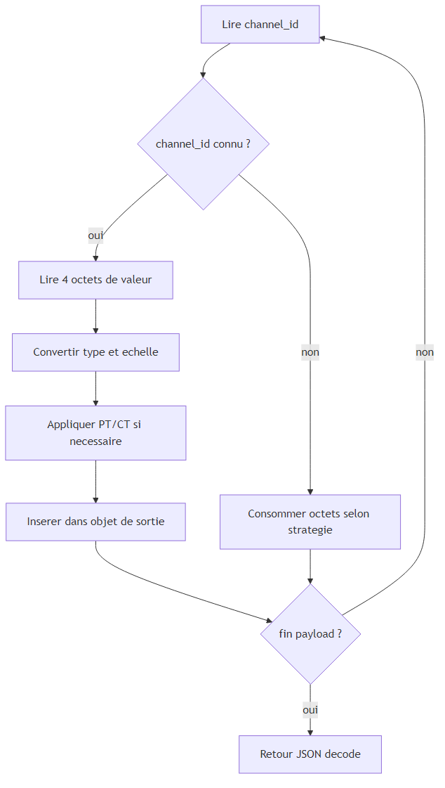

# Codec ADW300

## Resume executif

Ce document formalise la specification technique du codec ADW300. Le codec est un composant critique de qualite de donnees: une erreur de decodage se propage ensuite aux agregations, aux analyses et aux decisions operationnelles.

## 1. Objectif et perimetre

Le document definit:
1. le contrat entree/sortie du decodeur;
2. les regles de transformation binaire -> mesures physiques;
3. les mecanismes de robustesse en presence de trames degradees;
4. les exigences de validation et non-regression.

Le perimetre couvre exclusivement le decodage uplink ADW300 et la production de structures JSON metier.

## 2. Contrat fonctionnel du codec

### 2.1 Entree

1. un tableau d'octets (`bytes`) representant le payload radio;
2. un contexte d'execution LoRaWAN (plateforme reseau, fPort, metadonnees).

### 2.2 Sortie

Un objet JSON partiellement ou completement renseigne selon les canaux presents, comprenant notamment:
1. tensions et courants par phase;
2. puissances active/reactive/apparente;
3. energies cumulatives;
4. facteurs de puissance et indicateurs de qualite (THD, desequilibres);
5. temperatures et entrees digitales.

## 3. Modele de decodage

Le flux binaire est traite comme une sequence de couples `(channel_id, valeur)`, ce qui permet un decodage progressif et robuste meme lorsque la trame est heterogene.

### 3.1 Regles de conversion

1. la lecture numerique est realisee en entier non signe sur 4 octets;
2. des coefficients d'echelle sont appliques selon la grandeur mesuree;
3. les grandeurs electriques reelles dependent des coefficients PT/CT;
4. des options de configuration (endianness, checksum optionnel) doivent rester coherentes entre emetteur et decodeur.

### 3.2 Dependances PT/CT

Certaines mesures exigent que `PT` et `CT` aient ete prealablement captures. En absence de ces facteurs:
1. la valeur peut etre calculee de facon partielle ou differee;
2. le comportement doit etre explicite et stable;
3. aucun crash global ne doit se produire.

## 4. Taxonomie des canaux ADW300

Pour faciliter la lecture et la validation, le decodage est organise en familles de mesures:
1. configuration et etalonnage: PT, CT;
2. grandeurs instantanees: Ux, Ix, Px, Qx, Sx;
3. indicateurs de qualite: PF, THD, desequilibres;
4. energies cumulatives: EP, EPI, EPE, et variants par phase;
5. thermiques et digitaux: temperatures, DI.

Cette structuration facilite les tests et la lecture metier des donnees.

## 5. Exigences de robustesse

### 5.1 Tolerance aux trames incompletes

1. une trame tronquee ne doit pas invalider les donnees deja decodees;
2. les champs non lisibles sont ignores sans interruption globale;
3. le decodeur doit rester deterministic sur un meme payload.

### 5.2 Gestion des canaux inconnus

1. un canal non reconnu ne doit pas interrompre le parsing;
2. l'avance dans le buffer doit rester coherente pour eviter le desalignement;
3. la strategie de fallback doit etre documentee et testee.

### 5.3 Compatibilite multi-plateformes LoRaWAN

Le codec doit maintenir le meme resultat logique sur differents environnements reseau (formes de wrappers distinctes).

## 6. Controle qualite et tests

### 6.1 Matrice minimale de tests

| Classe de test | Objectif |
|---|---|
| Payload nominal complet | verifier exactitude de toutes familles de champs |
| Payload partiel | verifier degradation controlee |
| Payload avec canal inconnu | verifier resilience du parseur |
| Inversion endianness | verifier detection d'incoherence de configuration |
| Absence PT/CT | verifier comportement stable des grandeurs dependantes |

### 6.2 Criteres d'acceptation

1. absence d'exception fatale sur jeux de tests officiels;
2. exactitude numerique conforme aux coefficients definis;
3. stabilite des sorties JSON dans le temps (non-regression).

## 7. Exigences d'evolution

Toute evolution du codec doit respecter le protocole suivant:
1. specification du changement de canal ou de formule;
2. ajout de cas de tests representatifs;
3. validation croisee sur payloads de reference;
4. journalisation de version et impact aval.

## 8. Conclusion

Le codec ADW300 est un composant de souverainete metrique. Une specification rigoureuse et des tests systematiques sont indispensables pour maintenir la confiance dans toute la chaine energetique, de la collecte terrain jusqu'aux calculs analytiques et aux tableaux de bord decisionnels.

