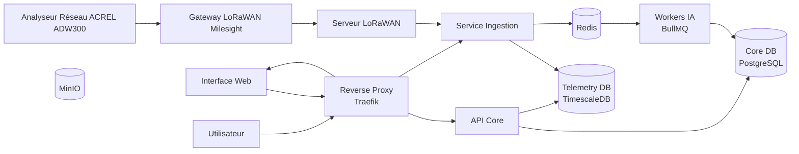
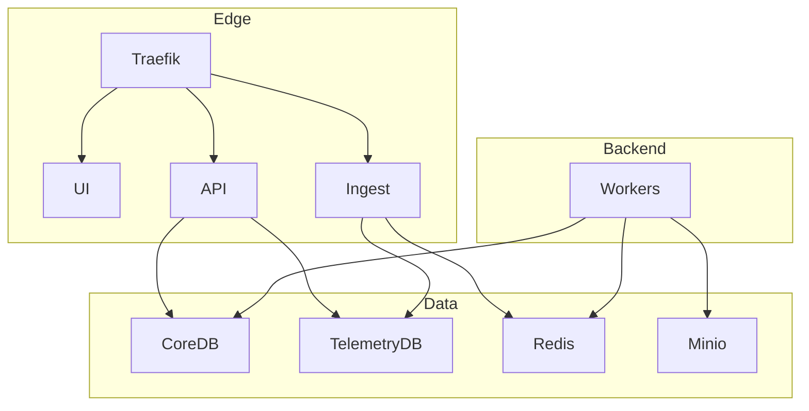
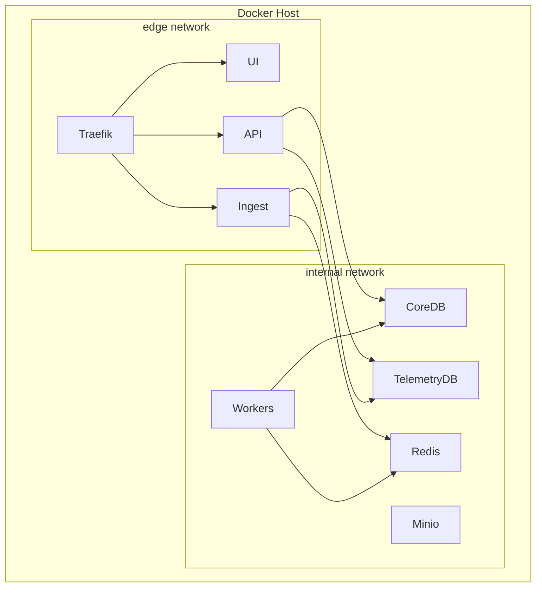
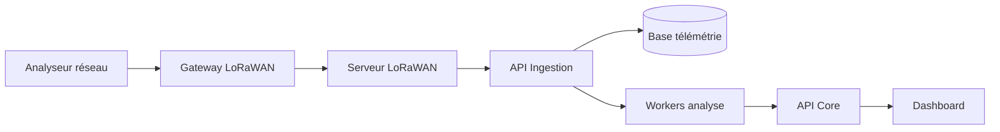

# Architecture Logicielle

## Plateforme SIMES-BF

**SIMES-BF — Système Intelligent de Management Énergétique et de prédimensionnement solaire**

---

# 1. Introduction

La plateforme **SIMES-BF** est une solution numérique destinée à la **surveillance énergétique, l’analyse des consommations électriques et le prédimensionnement de systèmes photovoltaïques**.

Le système repose sur une chaîne complète :

1. **Acquisition des données énergétiques**
2. **Transmission des données**
3. **Stockage et historisation**
4. **Analyse énergétique**
5. **Visualisation et supervision**
6. **Modules d’intelligence artificielle**

Les données proviennent principalement d’un **analyseur réseau triphasé ACREL ADW300** connecté via une **gateway LoRaWAN Milesight UG65**. 

L’architecture logicielle est basée sur :

* microservices
* conteneurisation Docker
* bases de données spécialisées
* services de traitement asynchrones

Cette architecture garantit :

* modularité
* évolutivité
* robustesse
* facilité de déploiement.

---

# 2. Architecture globale du système

## Diagramme d’architecture générale



---

# 3. Architecture microservices

L’architecture logicielle repose sur plusieurs services indépendants.

## Diagramme microservices



---

# 4. Architecture de déploiement Docker

## Diagramme de déploiement



---

# 5. Flux de données

## Diagramme du flux énergétique



---

# 6. Description des composants

## 6.1 Reverse Proxy – Traefik

Traefik est utilisé comme **point d’entrée unique de la plateforme**.

Fonctions :

* routage HTTP
* gestion dynamique des services Docker
* gestion SSL
* simplification du déploiement

Routes principales :

```
/        → interface utilisateur
/api     → API backend
/ingest  → ingestion des données
```

---

## 6.2 Interface Web

L’interface utilisateur permet :

* visualisation des consommations
* affichage des courbes de charge
* analyse énergétique
* préparation du dimensionnement solaire

Technologies utilisées :

```
React
Vite
Nginx
```

Nginx sert les fichiers statiques générés par le build frontend.

---

## 6.3 API Core

L’API Core est le **cœur logique du système**.

Fonctions :

* gestion des sites
* gestion des équipements
* accès aux données énergétiques
* gestion des analyses

Technologies :

```
Node.js
Express
PostgreSQL
```

---

## 6.4 Service d’ingestion

Le service d’ingestion reçoit les données issues des analyseurs réseau.

Fonctions :

* réception des messages
* décodage
* validation
* insertion en base de données

---

## 6.5 Workers de traitement

Les traitements lourds sont exécutés par des workers.

Types de traitements :

* analyse énergétique
* génération de rapports
* exécution des modèles IA

Technologie utilisée :

```
BullMQ
Redis
```

---

# 7. Bases de données

## 7.1 Core Database

Base PostgreSQL contenant :

* organisations
* sites
* équipements
* configuration
* résultats d’analyse

---

## 7.2 Base de télémétrie

La base télémétrique utilise **TimescaleDB**, une extension PostgreSQL optimisée pour les séries temporelles.

Données stockées :

* tension
* courant
* puissance
* énergie
* facteur de puissance

Ces grandeurs correspondent aux paramètres mesurés par les analyseurs réseau. 

---

# 8. Justification des choix technologiques

## 8.1 Reverse Proxy

| Technologie | Avantages                           | Inconvénients              |
| ----------- | ----------------------------------- | -------------------------- |
| Traefik     | auto config Docker, simple, moderne | moins connu que nginx      |
| Nginx       | très performant                     | configuration complexe     |
| HAProxy     | très rapide                         | moins adapté microservices |

**Choix : Traefik**

Justification :

* intégration native Docker
* configuration dynamique
* simplicité de déploiement

---

## 8.2 Backend

| Technologie | Performance     | Ecosystème   |
| ----------- | --------------- | ------------ |
| Node.js     | élevé I/O       | très riche   |
| Python      | bon             | excellent IA |
| Java        | très performant | lourd        |

**Choix : Node.js**

Justification :

* idéal pour API I/O intensives
* large écosystème
* rapidité de développement

---

## 8.3 Base de données télémétrie

| Base        | Optimisée séries temporelles |
| ----------- | ---------------------------- |
| PostgreSQL  | non                          |
| InfluxDB    | oui                          |
| TimescaleDB | oui                          |

Benchmark simplifié :

| Critère                | InfluxDB | TimescaleDB |
| ---------------------- | -------- | ----------- |
| SQL                    | non      | oui         |
| intégration PostgreSQL | non      | oui         |
| complexité             | moyenne  | faible      |

**Choix : TimescaleDB**

---

## 8.4 Queue system

| Technologie    | Performance | Simplicité    |
| -------------- | ----------- | ------------- |
| RabbitMQ       | très élevé  | complexe      |
| Kafka          | très élevé  | très complexe |
| Redis + BullMQ | élevé       | simple        |

**Choix : BullMQ + Redis**

---

## 8.5 Conteneurisation

| Technologie | Popularité  |
| ----------- | ----------- |
| Docker      | très élevée |
| Podman      | moyenne     |
| LXC         | faible      |

**Choix : Docker**

---

# 9. Sécurité

Mesures implémentées :

* isolation réseau Docker
* accès base limité
* reverse proxy unique
* authentification API

---

# 10. Évolutivité

L’architecture permet :

* ajout de nouveaux capteurs
* ajout de modules IA
* prédiction énergétique
* optimisation solaire
* intégration météo

Ces fonctionnalités permettront d’améliorer le **dimensionnement solaire basé sur les courbes de charge mesurées**. 

---

# 11. Conclusion

L’architecture logicielle SIMES-BF repose sur une infrastructure moderne basée sur des microservices conteneurisés.

Elle permet :

* la collecte fiable des données énergétiques
* leur stockage et leur analyse
* la visualisation des performances énergétiques
* l’intégration future de modules d’intelligence artificielle.

Cette architecture constitue une base solide pour le développement d’un **système intelligent de gestion énergétique adapté au contexte africain**.

